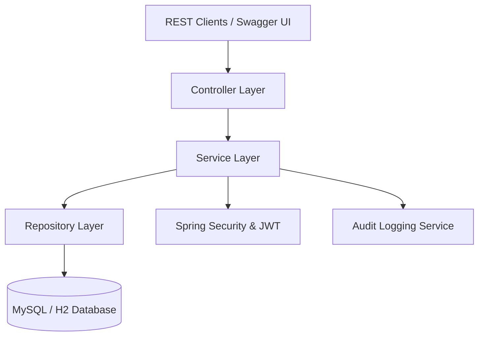
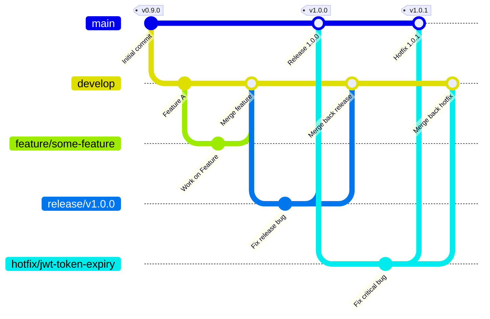

# Enterprise Resource Allocation & Skill Management System (ERASM)

[](https://github.com/your-username/ERASM/actions)

ERASM is a production-level Spring Boot enterprise application designed to manage, allocate, and monitor organization resources, skills, and certifications across multiple projects.

---

## 1. Project Overview & Problem Statement

In modern enterprise environments, managing employee skillsets, matching them to project requirements, and handling allocations while respecting capacities is a complex task. Organizations face:
- Lack of central visibility into employee skills and certifications.
- Sub-optimal resource utilization (either bench or over-allocation).
- Difficulty in processing resource requests from Delivery Managers.
- Absence of transparent audit trails for allocations and security activities.

**ERASM** solves these issues by providing a secure, role-based backend API to manage the entire lifecycle of resource requesting, capability mapping, allocation cap checks, and reporting.

---

## 2. Folder Structure

```
ERASM/
├── .github/
│   └── workflows/
│       └── ci.yml               # GitHub Actions CI pipeline configuration
├── docs/
│   └── GIT_FLOW.md             # Git Flow branching model & release documentation
├── src/
│   ├── main/
│   │   ├── java/com/erasm/core/ # Application source code
│   │   │   ├── config/          # Spring beans and configuration (Security, OpenAPI)
│   │   │   ├── controller/      # REST API Controllers (endpoints)
│   │   │   ├── dto/             # Data Transfer Objects (request/response models)
│   │   │   ├── entity/          # JPA Hibernate entities (database models)
│   │   │   ├── enums/           # Core system enums (Status, Roles, Skill levels)
│   │   │   ├── exception/       # Exception models & Global exception handler
│   │   │   ├── mapper/          # Entity-DTO mapping utilities (ModelMapper)
│   │   │   ├── repository/      # Spring Data JPA Repository layer
│   │   │   └── service/         # Service layer (business logic & implementations)
│   │   └── resources/
│   │       ├── application.properties
│   │       ├── db_creation.sql  # Database initialization script
│   │       └── ERASM_Postman_Collection.json
│   └── test/                    # JUnit and Mockito test suite
├── Dockerfile                   # Multi-stage Docker build file
├── .dockerignore                # Docker ignore patterns
├── docker-compose.yml           # Multi-container orchestration (App & MySQL)
├── mvnw                         # Maven wrapper script
├── pom.xml                      # Maven configuration
└── README.md                    # Project documentation (this file)
```

---

## 3. Architecture & Design

ERASM adheres to the **Controller-Service-Repository** layered architecture:



### Key Technical Stack:
- **Core Framework**: Spring Boot 3.x / 4.x
- **Security**: Spring Security (Stateless JWT Authentication & RBAC)
- **Data Access**: Spring Data JPA & Hibernate
- **Database**: H2 (Development & Testing), MySQL (Production ready)
- **Documentation**: SpringDoc OpenAPI / Swagger UI
- **Testing**: JUnit 5, Mockito, Jacoco (Code Coverage)
- **DevOps**: GitHub Actions, Docker, Docker Compose

---

## 4. API Documentation

Comprehensive Swagger/OpenAPI documentation is available at:
- **Swagger UI**: `http://localhost:8080/swagger-ui/index.html`
- **OpenAPI JSON Docs**: `http://localhost:8080/v3/api-docs`

### Major Endpoints Summary:
- **Authentication**: `POST /api/auth/register`, `POST /api/auth/login`, `POST /api/auth/logout`
- **Employee Profiles**: `GET /api/employees`, `POST /api/employees/{id}/skills`, `POST /api/employees/{id}/certifications`
- **Project Allocations**: `POST /api/allocations`, `PUT /api/allocations/{id}`, `DELETE /api/allocations/{id}`
- **Resource Requests**: `POST /api/resource-requests`, `PUT /api/resource-requests/{id}/status`
- **Reports**: `GET /api/reports/skills`, `GET /api/reports/utilization`, `GET /api/reports/allocations`
- **Auditing**: `GET /api/audits` (Admin & Auditor only)

---

## 5. Postman Collection & SQL Script

- **Postman Collection**: Located in `/src/main/resources/ERASM_Postman_Collection.json`. Import this file into Postman to quickly test all endpoints with pre-configured requests and environments.
- **Database Script**: Located in `/src/main/resources/db_creation.sql`. Run this on your MySQL server to initialize the database schema and seed roles, default skills, and an admin user.

---

## 6. Installation & Execution Guide

### Prerequisites:
- Java JDK 21
- Maven 3.x or `./mvnw` wrapper

### Steps to Run locally:
1. Clone the repository.
2. Build the project using Maven:
   ```bash
   ./mvnw clean install
   ```
3. Run the Spring Boot application:
   ```bash
   ./mvnw spring-boot:run
   ```
4. Access the API at `http://localhost:8080`.

---

## 7. Running with Docker & Docker Compose

### 7.1 Using Docker Compose (Recommended)
You can run both the database (`mysql`) and application (`erasm-app`) containers in a private network using Docker Compose.

1. Build and run the services:
   ```bash
   docker compose up --build -d
   ```
2. The application will wait for MySQL to become healthy and then start. Check logs using:
   ```bash
   docker compose logs -f erasm-app
   ```
3. Access Swagger UI at `http://localhost:8080/swagger-ui/index.html`.
4. Tear down the services:
   ```bash
   docker compose down -v
   ```

### 7.2 Standalone Docker Container
To build and run the application manually in a container:

1. Build the Docker image:
   ```bash
   docker build -t erasm-app .
   ```
2. Run the container (ensure you have a running MySQL instance accessible or configure H2 profiles):
   ```bash
   docker run -d -p 8080:8080 --name erasm-app erasm-app
   ```

---

## 8. Testing & Code Coverage

To run the unit tests and verify the build locally:
```bash
./mvnw clean verify
```
This command compiles the project, runs all 273 unit tests, checks verification rules, and generates a Jacoco Code Coverage report at `target/site/jacoco/index.html`. Open it in any browser to inspect code coverage.

---

## 9. CI/CD Pipeline

The project features a automated GitHub Actions workflow configured in `.github/workflows/ci.yml`. The pipeline:
1. Triggers on pushes and pull requests to `main` and `develop` branches.
2. Configures a Java 21 environment.
3. Caches Maven packages to accelerate build runs.
4. Executes `./mvnw clean verify` to run the entire unit test suite.
5. Packages and archives the executable Spring Boot JAR file as a workflow artifact.
6. Fails the build if any test fails.

---

## 10. Git Flow Workflow

We use the **Git Flow** branching strategy for release management and development.

### Git Flow Repository Structure
```text
main
│
├── develop
│
├── feature/*
├── release/*
└── hotfix/*
```

### Branching Strategy Diagram


### Summary of Branches:
* **`main`**: Production-ready code.
* **`develop`**: Main development branch.
* **`feature/*`**: New features branched from `develop`.
* **`release/*`**: Release candidate branches for testing and version tagging.
* **`hotfix/*`**: Critical bug fixes branched directly from `main` and merged back into `main` and `develop`.

For details on the branching strategy, merging procedure, versioning rules, and step-by-step guides with exact Git commands for release creation (`release/v1.0.0`) and hotfixes (`hotfix/jwt-token-expiry`), please read [docs/GIT_FLOW.md](docs/GIT_FLOW.md).

