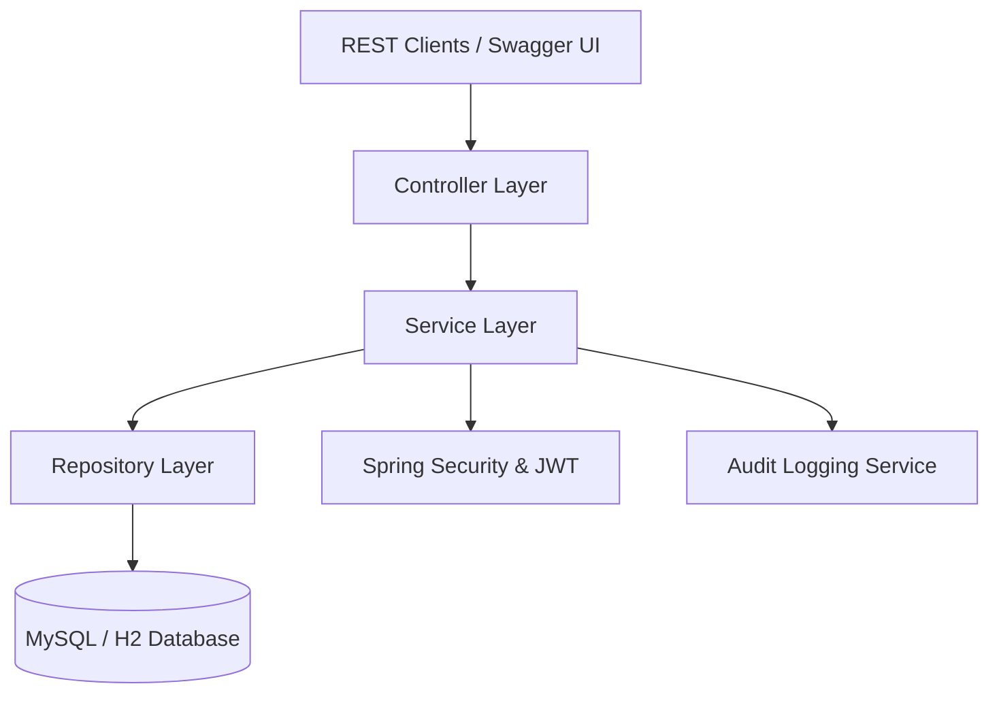
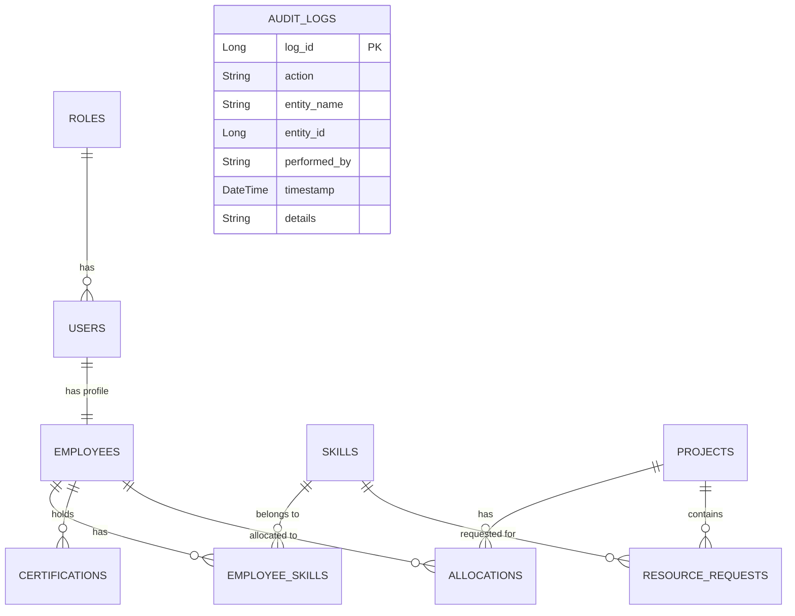

# Enterprise Resource Allocation & Skill Management System (ERASM)

ERASM is a production-level Spring Boot enterprise application designed to manage, allocate, and monitor organization resources, skills, and certifications across multiple projects.

---

## 1. Project Overview & Problem Statement

In modern enterprise environments, managing employee skillsets, matching them to project requirements, and handling allocations while respecting capacities is a complex task. Organizations face:
- Lack of central visibility into employee skills and certifications.
- Sub-optimal resource utilization (either bench or over-allocation).
- Difficulty in processing resource requests from Delivery Managers.
- Absence of transparent audit trails for allocations and security activities.

**ERASM** solves these issues by providing a secure, role-based backend API to manage the entire lifecycle of resource requesting, capability mapping, allocation cap checks, and reporting.

---

## 2. Architecture & Design

ERASM adheres to the **Controller-Service-Repository** layered architecture:



### Key Technical Stack:
- **Core Framework**: Spring Boot 3.x
- **Security**: Spring Security (Stateless JWT Authentication & RBAC)
- **Data Access**: Spring Data JPA & Hibernate
- **Database**: H2 (Development & Testing), MySQL (Production ready)
- **Documentation**: SpringDoc OpenAPI / Swagger UI
- **Testing**: JUnit 5, Mockito, Jacoco (Code Coverage)

---

## 3. Database Design & ER Diagram

The database is normalized to 3NF. Here is the Entity-Relationship diagram:



---

## 4. API Documentation

Comprehensive Swagger/OpenAPI documentation is available at:
- **Swagger UI**: `http://localhost:8080/swagger-ui/index.html`
- **OpenAPI JSON Docs**: `http://localhost:8080/v3/api-docs`

### Major Endpoints Summary:
- **Authentication**: `POST /api/auth/register`, `POST /api/auth/login`, `POST /api/auth/logout`
- **Employee Profiles**: `GET /api/employees`, `POST /api/employees/{id}/skills`, `POST /api/employees/{id}/certifications`
- **Project Allocations**: `POST /api/allocations`, `PUT /api/allocations/{id}`, `DELETE /api/allocations/{id}`
- **Resource Requests**: `POST /api/resource-requests`, `PUT /api/resource-requests/{id}/status`
- **Reports**: `GET /api/reports/skills`, `GET /api/reports/utilization`, `GET /api/reports/allocations`
- **Auditing**: `GET /api/audits` (Admin & Auditor only)

---

## 5. Postman Collection & SQL Script

- **Postman Collection**: Located in `/src/main/resources/ERASM_Postman_Collection.json`. Import this file into Postman to quickly test all endpoints with pre-configured requests and environments.
- **Database Script**: Located in `/src/main/resources/db_creation.sql`. Run this on your MySQL server to initialize the database schema and seed roles, default skills, and an admin user.

---

## 6. Installation & Execution Guide

### Prerequisites:
- Java JDK 21
- Maven 3.x or `./mvnw` wrapper

### Steps to Run locally:
1. Clone the repository.
2. Build the project using Maven:
   ```bash
   ./mvnw clean install
   ```
3. Run the Spring Boot application:
   ```bash
   ./mvnw spring-boot:run
   ```
4. Access the API at `http://localhost:8080`.

---

## 7. Testing & Code Coverage

To run the unit tests and generate the Jacoco Code Coverage report:
```bash
./mvnw clean test
```
The Jacoco HTML report will be generated at `target/site/jacoco/index.html`. Open it in any browser to inspect lines covered.
