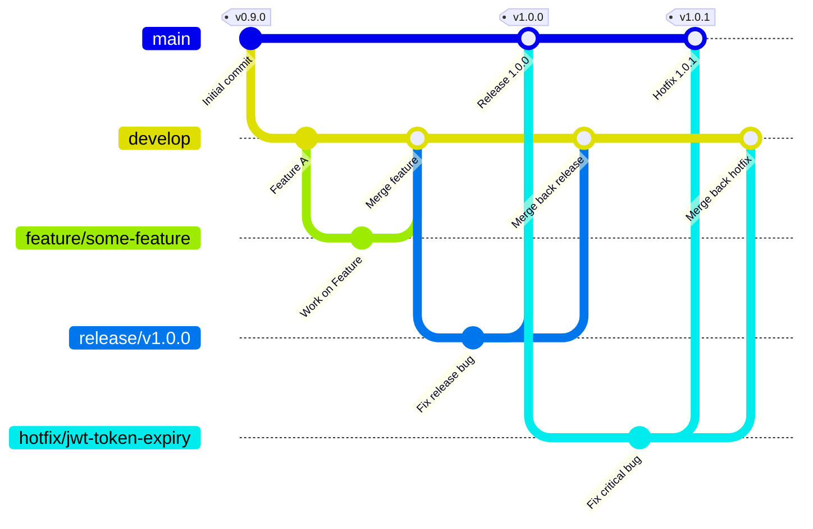

# ERASM Git Flow Branching Strategy & Release Documentation

This document outlines the standard Git Flow branching model, versioning strategy, and release workflows used in the Enterprise Resource Allocation & Skill Management System (ERASM) project.

---

## 1. Branching Strategy Overview

### Repository Branch Structure
Our Git repository follows the standard Git Flow structure:

```text
main
│
├── develop
│
├── feature/*
├── release/*
└── hotfix/*
```

### Branching Strategy Diagram
Below is the visualization of the branching model, depicting how features, releases, and hotfixes branch off and merge back:



### Perpetual Branches
1. **`main`**: Reflects the production-ready state of the code. Only fully tested and verified code (via release or hotfix branches) is merged here. Every commit on `main` is tagged with a release version.
2. **`develop`**: The main integration branch for ongoing development. It contains the latest delivered development changes for the next release.

### Supporting Branches
- **`feature/*`**: Used to develop new features.
- **`release/*`**: Used to prepare for a new production release.
- **`hotfix/*`**: Used to patch critical production bugs quickly.

---

## 2. Supporting Branch Workflows

### 2.1 Feature Branches (`feature/*`)
* **Purpose**: Develop new user stories, tasks, or API endpoints.
* **Parent Branch**: `develop`
* **Target Branch**: `develop`
* **Naming Convention**: `feature/<issue-id>-<short-description>` (e.g. `feature/ERASM-101-auth-jwt`)

#### Workflow:
1. Create and checkout the branch from `develop`:
   ```bash
   git checkout develop
   git pull origin develop
   git checkout -b feature/ERASM-101-auth-jwt
   ```
2. Commit changes using descriptive messages matching enterprise standards.
3. Keep the branch updated by pulling `develop` regularly:
   ```bash
   git pull origin develop
   ```
4. Push to remote:
   ```bash
   git push origin feature/ERASM-101-auth-jwt
   ```
5. Open a Pull Request (PR) to merge into `develop`. Once approved, code quality checks pass, and code review is complete, merge the PR (preferably using squash-and-merge to keep develop history clean).

---

### 2.2 Develop Branch Workflow
* **Purpose**: Integrates all feature branches.
* Runs automated integration tests on pull requests.
* Nightly or staging deployments are triggered from this branch.
* Direct commits to `develop` should be avoided; use PRs from feature branches instead.

---

### 2.3 Release Branch Workflow (`release/*`)
* **Purpose**: Preparation and stabilization of a new production release. Allows for minor bug fixes, final QA cycles, and release validation.
* **Parent Branch**: `develop`
* **Target Branches**: `main` and `develop`
* **Naming Convention**: `release/v<major>.<minor>.<patch>` (e.g. `release/v1.0.0`)

#### Steps for the Release Process:
1. **Create from develop**: Cut a new release branch from develop when it is stable and has all features planned for the release.
2. **Run final testing**: Execute unit, integration, and security tests. Perform staging/UAT deployments and final QA sign-off.
3. **Fix release-only bugs**: Commit fixes directly to the release branch for any bugs found during QA.
4. **Merge into main**: Once stable, merge the release branch into `main`.
5. **Create Git tag**: Tag the merge commit on `main` with the release version.
6. **Merge back into develop**: Merge the release branch back into `develop` to ensure bug fixes are not lost.
7. **Delete release branch**: Clean up by deleting the branch locally and remotely after a successful release.

#### Exact Git Commands:
```bash
git checkout develop
git pull origin develop
git checkout -b release/v1.0.0
git push -u origin release/v1.0.0
```

*Perform staging validation, final testing, and fix release-only bugs on the release branch.*

```bash
git checkout main
git merge release/v1.0.0
git push origin main
```

```bash
git tag -a v1.0.0 -m "ERASM Version 1.0.0"
git push origin v1.0.0
```

```bash
git checkout develop
git merge release/v1.0.0
git push origin develop
```

```bash
git branch -d release/v1.0.0
git push origin --delete release/v1.0.0
```

---

### 2.4 Hotfix Branch Workflow (`hotfix/*`)
* **Purpose**: Address critical bugs discovered in the production environment that cannot wait for the next release cycle.
* **Parent Branch**: `main`
* **Target Branches**: `main` and `develop`
* **Naming Convention**: `hotfix/<bug-description>` (e.g. `hotfix/jwt-token-expiry`)

#### Steps for the Hotfix Process:
1. **Create from main**: Hotfix branches are always created directly from `main` to ensure we are patching the exact production codebase.
2. **Fix production bugs**: Implement the fix (e.g., resolving JWT token expiry) and verify locally using the test suite.
3. **Merge into main**: Merge the hotfix branch back into `main` to deploy the fix to production.
4. **Create Git tag**: Tag the merge commit on `main` with the incremented patch version.
5. **Merge back into develop**: Merge the hotfix branch back into `develop` to ensure the bug fix persists in future releases.
6. **Delete hotfix branch**: Clean up by deleting the branch locally and remotely after deployment.

#### Exact Git Commands for `hotfix/jwt-token-expiry`:
```bash
git checkout main
git pull origin main
git checkout -b hotfix/jwt-token-expiry
git push -u origin hotfix/jwt-token-expiry
```

*Implement and test the fix locally.*

```bash
git add .
git commit -m "Fix JWT token expiry issue"
git push
```

```bash
git checkout main
git merge hotfix/jwt-token-expiry
git push origin main
```

```bash
git checkout develop
git merge hotfix/jwt-token-expiry
git push origin develop
```

```bash
git branch -d hotfix/jwt-token-expiry
git push origin --delete hotfix/jwt-token-expiry
```

---

## 3. Versioning Strategy

We follow **Semantic Versioning 2.0.0 (SemVer)**:
* Format: `MAJOR.MINOR.PATCH`
* **MAJOR**: Incremented for incompatible API changes.
* **MINOR**: Incremented for backward-compatible functionality additions.
* **PATCH**: Incremented for backward-compatible bug fixes (e.g. security hotfixes).

Development versions must suffix `-SNAPSHOT` (e.g., `1.1.0-SNAPSHOT`) when working on `develop` to clearly signal pre-release code.
